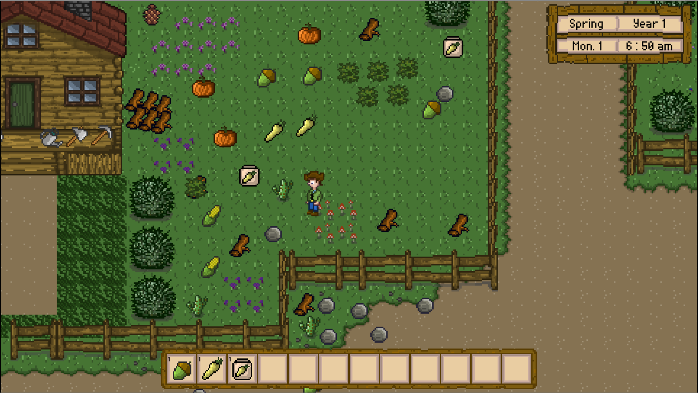

# 2D Farming RPG Game

## Overview
This is just a learning attempt to create a clone like Stardew Valley. In this project, I am trying to learn the best practices of Unity and C# alone with design patterns and OOP concepts. This project is still under construction.
I will soon add a small demo.
 

 
## Installation and Documentation

Please Click [Here](https://pubudus.github.io/Farming_RPG/) to go to the documentation website. Installation instruction are also avaiable in the website.
